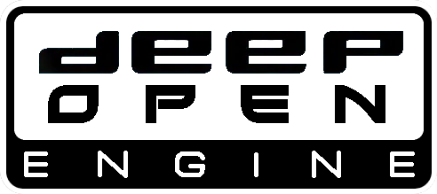
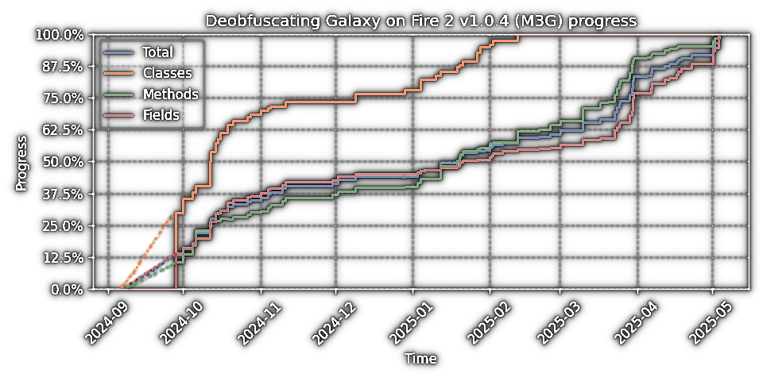

  

Deep Open - attempt to recreate source code of Fishlabs games and their common core Abyss Engine, by revese engineering, for education and entertainment purposes.

Currently the essence of this repo is decompiled, deobfuscated code of [GoF2](/code/GoF2_jsr/) version 1.0.4 (the last update for J2ME published for free by the Fihlabs in 2009). Which can be [compiled and built](./code/build/) back. 
___

  

___
### Goals
* Expand features, improve quality.

* Port to to other platform (mainly PC).

* Deobfuscate other AE games.

___

### How to contribute?
You can for example:
* look into [issues](https://github.com/BaalNetbek/DeepOpen/issues) for things to do.
* propose something your ideas in [discussions](https://github.com/BaalNetbek/DeepOpen/discussions).
* report bugs in [issues](https://github.com/BaalNetbek/DeepOpen/issues).

Don't:
* Don't automatically format and otherwise refactor in one pull request as it makes it hard to verify changes.
---

For analysis I used mainly:\
 [Col-E/Recaf](https://github.com/Col-E/Recaf)\
 [shinovon/KEmulator](https://github.com/shinovon/KEmulator)\
 [NationalSecurityAgency/ghidra](https://github.com/NationalSecurityAgency/ghidra) (GoF binaries for non Java platforms)\
 [MinecraftForge/Srg2Source](https://github.com/MinecraftForge/Srg2Source)\
 [FabricMC/Matcher](https://github.com/FabricMC/Matcher)

---
More: \
 [Smert124/Galaxy-on-Fire-2-Reforged](https://github.com/Smert124/Galaxy-on-Fire-2-Reforged) (GoF2 mod using DeepOpen mapping)\
 [Renaming inspiration](/extras/gof2-1.0.1-ios-symbols/simple-mapping)\
 [Lookup tables for GoF2](https://docs.google.com/spreadsheets/u/1/d/e/2PACX-1vRjJFtnrG9-7vdqHtHtPCu0Tg7C-1A89lxo434_7fgEguS9I6O1u3wcRmoWnHEhgUP2Mbd9EMIzAPJA/pubhtml#)\
 [raw gof2 decomp](https://github.com/BaalNetbek/gof2.jar-decomp/) (how it started)\
 [other extras](extras/)